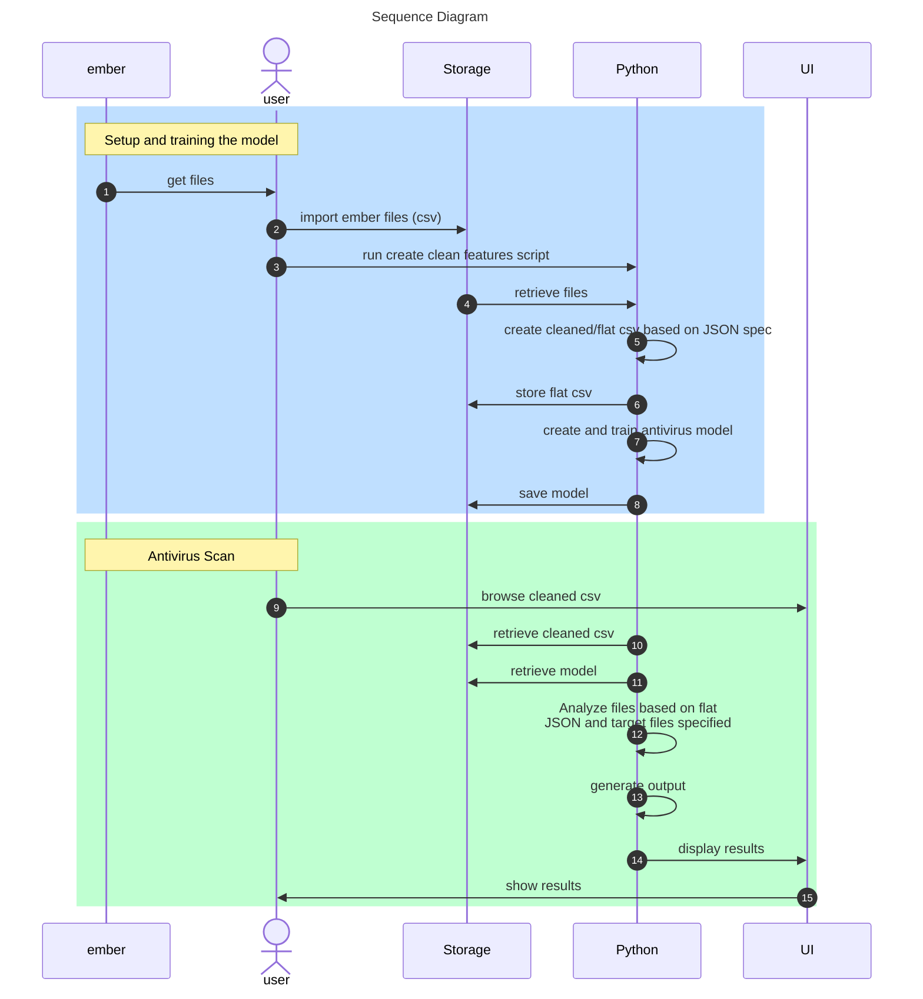

```mermaid
sequenceDiagram
 
autonumber
title Sequence Diagram
Participant ember
Actor user
rect rgb(191, 223, 255)
Note over ember, user: Setup and training the model
ember->>user: get files
user->>Storage: import ember files (csv)
user->>Python: run create clean features script
Storage->>Python: retrieve files
Python->>Python: create cleaned/flat csv based on JSON spec
Python->>Storage: store flat csv
Python->>Python: create and train antivirus model
Python->>Storage: save model
end
rect rgb(191, 255, 209)
Note over ember, user: Antivirus Scan
user->>UI: browse cleaned csv
Python->>Storage: retrieve cleaned csv
Python->>Storage: retrieve model
Python->>Python: Analyze files based on flat <BR> JSON and target files specified
Python->>Python: generate output
Python->>UI: display results
UI->>user: show results
end
```